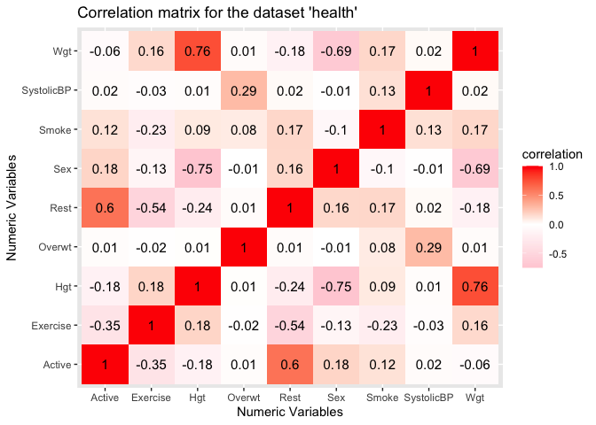
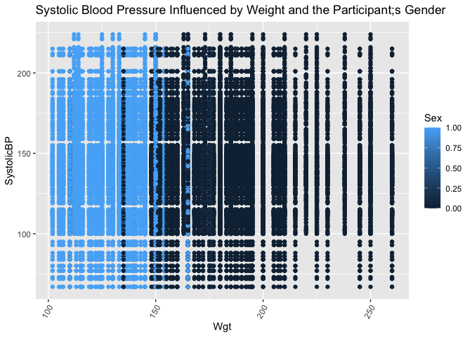
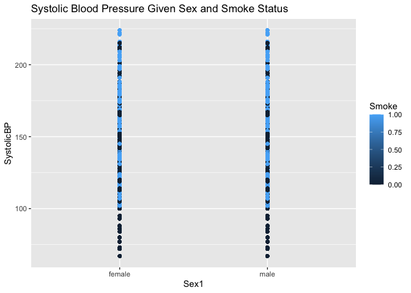
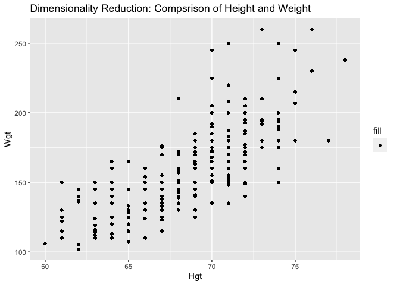
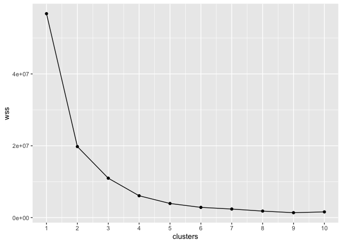

Research Project \#1: Comparison of Various Health Factors Given the
Smoking Status of Participants
================
SDS348 Spring 2021

## Channing Burba, cb48596

**Introduction:**

The first dataset that I chose, ‘Pulse,’ measures the pulse rate of
individuals prior to and after exercise. The variables include:
‘Active’-The pulse rate of an individual prior to and after exercise,
‘Rest’-The participants regular resting pulse, ‘Smoke’-An indication on
whether the participant is a smoker or non-smoker, ‘sex’-The gender of
the individual, ‘Exercise’-The number of hours the participant exercises
per week, ‘Hgt’-The individual’s height, and ‘Wgt’-The individual’s
weight. The second dataset in which I compared to the first was
‘Blood1.’ This dataset shows the smoking status, blood pressure, and
weight of the participants in the study. The variables in this dataset
include: ‘SystolicBP’-The systolic blood pressure of the individual,
‘Smoke’-An indication on whether the participant is a smoker or
nonsmoker, and ‘Overwt’- An indication of how overweight individuals are
(normal, overweight, or obese). The ‘Pulse’ dataset was acquired by both
survey and experimentation. The participant’s pulses were recorded
before and after walking 3 laps up and down a set of stairs, while
information regarding their height, weight, sex, and smoking status was
acquired through survey. As for the ‘Blood1’ dataset, this information
was acquired via the “2003 Annual Meeting of the Statistical Society of
Canada” case study. This topic is interesting to me because health and
fitness is a huge part of my life. I would love for healthy living to be
a more widespread subject, so by creating this research project that
compares all of my chosen variables, I hope to explain to readers why
regular exercise, not smoking, and healthy living in general is
important to both your health and well-being. Some potential
associations I expect is: Smokers will have a higher systolic blood
pressure, higher weight, and higher resting pulse rate than individuals
who do not smoke.

**1. Tidy:**

My data happened to already be tidy once exported to R-Studio. However,
one could use the functions “pivot\_longer,” “pivot\_wider,” or
“separate()” in order to make the data to look neater. If there were any
missing values, “na\_if(‘-’)” could be used to replace “-” with an “na”
instead.

``` r
library(readxl) #Opens 'readxl' package to make it easy to get data out of Excel and put it into R
Pulse <- read_excel("Pulse.xlsx") #Reads the excel sheet 'Pulse'
View(Pulse) #Opens the 'Pulse' dataset in R 

library(readxl) #Opens 'readxl' package to make it easy to get data out of Excel and put it into R
Blood <- read_excel("Blood.xlsx") #Reads the excel sheet 'Blood'
View(Blood) #Opens the 'Blood' dataset in R
```

**2. Join/Merge:**

``` r
library(readxl) #Opens 'readxl' package to make it easy to get data out of Excel and put it into R
Pulse <- read_excel("Pulse.xlsx") #Reads the excel sheet 'Pulse'
View(Pulse) #Opens the 'Pulse' dataset in R 

library(readxl) #Opens 'readxl' package to make it easy to get data out of Excel and put it into R
Blood <- read_excel("Blood.xlsx") #Reads the excel sheet 'Blood'
View(Blood) #Opens the 'Blood' dataset in R

library("dplyr") #Opens 'dplyr' package
health <- Blood %>% inner_join(Pulse, by=c("Smoke"= "Smoke")) #Joins together the two datasets 'Pulse' and 'Blood' by the common variable 'Smoke'
health #Returns the new data/table 'health' which is 'Pulse' and 'Blood' joined together on the basis of the common variable 'Smoke'
```

    ## # A tibble: 55,120 x 9
    ##    SystolicBP Smoke Overwt Active  Rest   Sex Exercise   Hgt   Wgt
    ##         <dbl> <dbl>  <dbl>  <dbl> <dbl> <dbl>    <dbl> <dbl> <dbl>
    ##  1        133     0      2     97    78     1        1    63   119
    ##  2        133     0      2     88    62     0        3    72   175
    ##  3        133     0      2    106    74     0        3    72   170
    ##  4        133     0      2     78    63     1        3    67   125
    ##  5        133     0      2    109    65     0        3    74   188
    ##  6        133     0      2     66    43     1        3    67   140
    ##  7        133     0      2     68    65     0        3    70   200
    ##  8        133     0      2    100    63     0        1    70   165
    ##  9        133     0      2     70    59     1        2    65   115
    ## 10        133     0      2     98    57     0        3    72   175
    ## # … with 55,110 more rows

During this portion of my research, I joined the two datasets ‘Blood’
and ‘Pulse’ together through ‘inner\_join’ because this function matches
pairs of observations. Rather than keeping all of the data from one
particular dataset (or in general), this function is able to see common
variables within each dataset and join it so duplication of the same
variable does not occur. This means that RStudio will return a table in
which the variable “Smoke” from the ‘Blood’ and ‘Pulse’ datasets will
match. During this process, I did not drop any cases because each
variable plays an equally important role in determining the health and
wellness of each individual in the study. If I removed any cases, there
would be a possibility of confounding variables.

**3. Summary Statistics:**

``` r
library("dplyr") #Opens 'dplyr' package 
filter(health, Smoke == "1") #Filters the dataset to only show data that applies to "smokers"
```

    ## # A tibble: 6,916 x 9
    ##    SystolicBP Smoke Overwt Active  Rest   Sex Exercise   Hgt   Wgt
    ##         <dbl> <dbl>  <dbl>  <dbl> <dbl> <dbl>    <dbl> <dbl> <dbl>
    ##  1        115     1      0     82    68     0        3    70   225
    ##  2        115     1      0     86    68     0        2    73   195
    ##  3        115     1      0     87    72     0        2    70   173
    ##  4        115     1      0    102    77     0        2    72   200
    ##  5        115     1      0     80    67     1        2    65   133
    ##  6        115     1      0     99    78     0        3    71   165
    ##  7        115     1      0    125    80     1        3    65   125
    ##  8        115     1      0    133    92     0        1    69   185
    ##  9        115     1      0     91    65     0        2    67   150
    ## 10        115     1      0     96    67     1        2    64   165
    ## # … with 6,906 more rows

``` r
filter(health, SystolicBP > 140) #Filters the dataset to only show data that applies to individuals with a Systolic blood pressure over 140 
```

    ## # A tibble: 25,940 x 9
    ##    SystolicBP Smoke Overwt Active  Rest   Sex Exercise   Hgt   Wgt
    ##         <dbl> <dbl>  <dbl>  <dbl> <dbl> <dbl>    <dbl> <dbl> <dbl>
    ##  1        154     1      2     82    68     0        3    70   225
    ##  2        154     1      2     86    68     0        2    73   195
    ##  3        154     1      2     87    72     0        2    70   173
    ##  4        154     1      2    102    77     0        2    72   200
    ##  5        154     1      2     80    67     1        2    65   133
    ##  6        154     1      2     99    78     0        3    71   165
    ##  7        154     1      2    125    80     1        3    65   125
    ##  8        154     1      2    133    92     0        1    69   185
    ##  9        154     1      2     91    65     0        2    67   150
    ## 10        154     1      2     96    67     1        2    64   165
    ## # … with 25,930 more rows

``` r
select(health, type = "Sex",
     keys = c("Hgt", "Wgt"),
     keytype = "Smoke") #Returns a new table in which the type is 'Sex,' the two keys for comparison are 'Hgt' and 'Wgt,' and the key type is whether or not the individual is a smoker or not
```

    ## # A tibble: 55,120 x 4
    ##     type keys1 keys2 keytype
    ##    <dbl> <dbl> <dbl>   <dbl>
    ##  1     1    63   119       0
    ##  2     0    72   175       0
    ##  3     0    72   170       0
    ##  4     1    67   125       0
    ##  5     0    74   188       0
    ##  6     1    67   140       0
    ##  7     0    70   200       0
    ##  8     0    70   165       0
    ##  9     1    65   115       0
    ## 10     0    72   175       0
    ## # … with 55,110 more rows

``` r
select(health, Overwt, keys = NULL, keytype = NULL) #Returns only the column 'Overwt' from the 'Blood' dataset 
```

    ## # A tibble: 55,120 x 1
    ##    Overwt
    ##     <dbl>
    ##  1      2
    ##  2      2
    ##  3      2
    ##  4      2
    ##  5      2
    ##  6      2
    ##  7      2
    ##  8      2
    ##  9      2
    ## 10      2
    ## # … with 55,110 more rows

``` r
arrange(health, desc(Active)) #Returns the 'Pulse' dataset, however, the column 'Active' is being arranged in descending order (high to low)
```

    ## # A tibble: 55,120 x 9
    ##    SystolicBP Smoke Overwt Active  Rest   Sex Exercise   Hgt   Wgt
    ##         <dbl> <dbl>  <dbl>  <dbl> <dbl> <dbl>    <dbl> <dbl> <dbl>
    ##  1        133     0      2    154    82     0        1    71   250
    ##  2        132     0      2    154    82     0        1    71   250
    ##  3        133     0      1    154    82     0        1    71   250
    ##  4        138     0      1    154    82     0        1    71   250
    ##  5        133     0      2    154    82     0        1    71   250
    ##  6         67     0      0    154    82     0        1    71   250
    ##  7        138     0      0    154    82     0        1    71   250
    ##  8        140     0      1    154    82     0        1    71   250
    ##  9        107     0      0    154    82     0        1    71   250
    ## 10        131     0      1    154    82     0        1    71   250
    ## # … with 55,110 more rows

``` r
arrange(health, SystolicBP) #Returns the 'Blood' dataset, however, the column 'SystolicBP' is being arranged in ascending order (low to high) 
```

    ## # A tibble: 55,120 x 9
    ##    SystolicBP Smoke Overwt Active  Rest   Sex Exercise   Hgt   Wgt
    ##         <dbl> <dbl>  <dbl>  <dbl> <dbl> <dbl>    <dbl> <dbl> <dbl>
    ##  1         67     0      0     97    78     1        1    63   119
    ##  2         67     0      0     88    62     0        3    72   175
    ##  3         67     0      0    106    74     0        3    72   170
    ##  4         67     0      0     78    63     1        3    67   125
    ##  5         67     0      0    109    65     0        3    74   188
    ##  6         67     0      0     66    43     1        3    67   140
    ##  7         67     0      0     68    65     0        3    70   200
    ##  8         67     0      0    100    63     0        1    70   165
    ##  9         67     0      0     70    59     1        2    65   115
    ## 10         67     0      0     98    57     0        3    72   175
    ## # … with 55,110 more rows

``` r
groupped <- health %>% group_by(Active) #Groups by 'Active.' This does not change how the data looks, it just lists the data by how it is grouped
groupped #Returns 'groupped' data
```

    ## # A tibble: 55,120 x 9
    ## # Groups:   Active [73]
    ##    SystolicBP Smoke Overwt Active  Rest   Sex Exercise   Hgt   Wgt
    ##         <dbl> <dbl>  <dbl>  <dbl> <dbl> <dbl>    <dbl> <dbl> <dbl>
    ##  1        133     0      2     97    78     1        1    63   119
    ##  2        133     0      2     88    62     0        3    72   175
    ##  3        133     0      2    106    74     0        3    72   170
    ##  4        133     0      2     78    63     1        3    67   125
    ##  5        133     0      2    109    65     0        3    74   188
    ##  6        133     0      2     66    43     1        3    67   140
    ##  7        133     0      2     68    65     0        3    70   200
    ##  8        133     0      2    100    63     0        1    70   165
    ##  9        133     0      2     70    59     1        2    65   115
    ## 10        133     0      2     98    57     0        3    72   175
    ## # … with 55,110 more rows

``` r
health %>% mutate(Smoke1=recode(Smoke, 
                         `0`="nonsmoker",
                         `1`="smoker")) #Returns the 'health' data but with a new variable 'Smoke1.' This is a new categorical variable that turns '0' into 'nonsmoker' and '1 into 'smoker'
```

    ## # A tibble: 55,120 x 10
    ##    SystolicBP Smoke Overwt Active  Rest   Sex Exercise   Hgt   Wgt Smoke1   
    ##         <dbl> <dbl>  <dbl>  <dbl> <dbl> <dbl>    <dbl> <dbl> <dbl> <chr>    
    ##  1        133     0      2     97    78     1        1    63   119 nonsmoker
    ##  2        133     0      2     88    62     0        3    72   175 nonsmoker
    ##  3        133     0      2    106    74     0        3    72   170 nonsmoker
    ##  4        133     0      2     78    63     1        3    67   125 nonsmoker
    ##  5        133     0      2    109    65     0        3    74   188 nonsmoker
    ##  6        133     0      2     66    43     1        3    67   140 nonsmoker
    ##  7        133     0      2     68    65     0        3    70   200 nonsmoker
    ##  8        133     0      2    100    63     0        1    70   165 nonsmoker
    ##  9        133     0      2     70    59     1        2    65   115 nonsmoker
    ## 10        133     0      2     98    57     0        3    72   175 nonsmoker
    ## # … with 55,110 more rows

``` r
health %>% mutate(Sex1=recode(Sex, 
                         `0`="male",
                         `1`="female")) #Returns the 'health' data but with a new variable 'Sex1.' This is a new categorical variable that turns '0' into 'male' and '1' into 'female'
```

    ## # A tibble: 55,120 x 10
    ##    SystolicBP Smoke Overwt Active  Rest   Sex Exercise   Hgt   Wgt Sex1  
    ##         <dbl> <dbl>  <dbl>  <dbl> <dbl> <dbl>    <dbl> <dbl> <dbl> <chr> 
    ##  1        133     0      2     97    78     1        1    63   119 female
    ##  2        133     0      2     88    62     0        3    72   175 male  
    ##  3        133     0      2    106    74     0        3    72   170 male  
    ##  4        133     0      2     78    63     1        3    67   125 female
    ##  5        133     0      2    109    65     0        3    74   188 male  
    ##  6        133     0      2     66    43     1        3    67   140 female
    ##  7        133     0      2     68    65     0        3    70   200 male  
    ##  8        133     0      2    100    63     0        1    70   165 male  
    ##  9        133     0      2     70    59     1        2    65   115 female
    ## 10        133     0      2     98    57     0        3    72   175 male  
    ## # … with 55,110 more rows

``` r
health %>% summarise(SystolicBP = sum(SystolicBP)) #Returns the sum of all systolic blood pressures in the dataset 
```

    ## # A tibble: 1 x 1
    ##   SystolicBP
    ##        <dbl>
    ## 1    7746796

``` r
pulses <- health %>% group_by(Active, Rest) #Groups information on participants based on their resting and active pulses
    pulses1 <- pulses %>% summarise(n = n()) #Returns information on the current group size within the variables 'Active' and 'Rest'
    pulses1 #Returns new table created from above
```

    ## # A tibble: 205 x 3
    ## # Groups:   Active [73]
    ##    Active  Rest     n
    ##     <dbl> <dbl> <int>
    ##  1     51    54   234
    ##  2     56    52   234
    ##  3     60    54   234
    ##  4     60    55   234
    ##  5     60    58   234
    ##  6     61    53   234
    ##  7     63    53   234
    ##  8     64    48   234
    ##  9     64    60   234
    ## 10     65    54   234
    ## # … with 195 more rows

``` r
mean(health$Active) #Gives the mean of the variable 'Active' within the dataset 'health'
```

    ## [1] 91.39046

``` r
sd(health$Active) #Gives the standard deviation of the variable 'Active' within the dataset 'health'
```

    ## [1] 18.79114

``` r
var(health$Active) #Gives the variance of variable 'Active' within the dataset 'health'
```

    ## [1] 353.107

``` r
median(health$Active) #Gives the median of variable 'Active' within the dataset 'health'
```

    ## [1] 89

``` r
quantile(health$Active) #Gives the interquartile range of variable 'Active' within the dataset 'health'
```

    ##   0%  25%  50%  75% 100% 
    ##   51   79   89  102  154

``` r
min(health$Active) #Gives the minimum value of variable 'Active' within the dataset 'health'
```

    ## [1] 51

``` r
max(health$Active) #Gives the maximum of variable 'Active' within the dataset 'health'
```

    ## [1] 154

``` r
n_distinct(health$Active) #Gives the number of distinct values of variable 'Active' within the dataset 'health'
```

    ## [1] 73

``` r
range(health$Active) #Gives the range of variable 'Active' within the dataset 'health'
```

    ## [1]  51 154

``` r
mean(health$Rest) #Gives the mean of variable 'Rest' within the dataset 'health'
```

    ## [1] 68.41586

``` r
sd(health$Rest) #Gives the standard deviation of variable 'Rest' within the dataset 'health'
```

    ## [1] 9.937888

``` r
var(health$Rest) #Gives the variance of variable 'Rest' within the dataset 'health'
```

    ## [1] 98.76162

``` r
median(health$Rest) #Gives the median of variable 'Rest' within the dataset 'health'
```

    ## [1] 68

``` r
quantile(health$Rest) #Gives the interquartile range of variable 'Rest' within the dataset 'health'
```

    ##   0%  25%  50%  75% 100% 
    ##   43   62   68   74  106

``` r
min(health$Rest) #Gives the minimum value of variable 'Rest' within the dataset 'health'
```

    ## [1] 43

``` r
max(health$Rest) #Gives the maximum value of variable 'Rest' within the dataset 'health'
```

    ## [1] 106

``` r
n_distinct(health$Rest) #Gives the number of distinct values of variable 'Rest' within the dataset 'health'
```

    ## [1] 47

``` r
range(health$Rest) #Gives the range of variable 'Rest' within the dataset 'health'
```

    ## [1]  43 106

``` r
mean(health$Smoke) #Gives the mean of variable 'Smoke' within the dataset 'health'
```

    ## [1] 0.1254717

``` r
sd(health$Smoke) #Gives the standard deviation of variable 'Smoke' within the dataset 'health'
```

    ## [1] 0.331256

``` r
var(health$Smoke) #Gives the variance of variable 'Smoke' within the dataset 'health'
```

    ## [1] 0.1097305

``` r
median(health$Smoke) #Gives the median of variable 'Smoke' within the dataset 'health'
```

    ## [1] 0

``` r
quantile(health$Smoke) #Gives the interquartile range of variable 'Smoke' within the dataset 'health'
```

    ##   0%  25%  50%  75% 100% 
    ##    0    0    0    0    1

``` r
min(health$Smoke) #Gives the minimum value of variable 'Smoke' within the dataset 'health'
```

    ## [1] 0

``` r
max(health$Smoke) #Gives the maximum value of variable 'Smoke' within the dataset 'health'
```

    ## [1] 1

``` r
n_distinct(health$Smoke) #Gives the number of distinct values of variable 'Smoke' within the dataset 'health'
```

    ## [1] 2

``` r
range(health$Smoke) #Gives the range of variable 'Smoke' within the dataset 'health'
```

    ## [1] 0 1

``` r
sexstatus <- health %>%
  mutate(Sex1 = case_when(Sex == 0 ~ "male",
                              Sex == 1 ~ "female")) #Returns a table with a new categorical variable "Sex" with the options of: female and male

sexstatus %>% group_by(Sex1) #Groups by the new categorical variable 'Sex1' within the data 'sexstatus'
```

    ## # A tibble: 55,120 x 10
    ## # Groups:   Sex1 [2]
    ##    SystolicBP Smoke Overwt Active  Rest   Sex Exercise   Hgt   Wgt Sex1  
    ##         <dbl> <dbl>  <dbl>  <dbl> <dbl> <dbl>    <dbl> <dbl> <dbl> <chr> 
    ##  1        133     0      2     97    78     1        1    63   119 female
    ##  2        133     0      2     88    62     0        3    72   175 male  
    ##  3        133     0      2    106    74     0        3    72   170 male  
    ##  4        133     0      2     78    63     1        3    67   125 female
    ##  5        133     0      2    109    65     0        3    74   188 male  
    ##  6        133     0      2     66    43     1        3    67   140 female
    ##  7        133     0      2     68    65     0        3    70   200 male  
    ##  8        133     0      2    100    63     0        1    70   165 male  
    ##  9        133     0      2     70    59     1        2    65   115 female
    ## 10        133     0      2     98    57     0        3    72   175 male  
    ## # … with 55,110 more rows

``` r
mean(sexstatus$Active) #Gives the mean of the variable 'Active' within the dataset 'sexstatus'
```

    ## [1] 91.39046

``` r
sd(sexstatus$Active) #Gives the standard deviation of the variable 'Active' within the dataset 'sexstatus'
```

    ## [1] 18.79114

``` r
var(sexstatus$Active) #Gives the variance of variable 'Active' within the dataset 'sexstatus'
```

    ## [1] 353.107

``` r
median(sexstatus$Active) #Gives the median of variable 'Active' within the dataset 'sexstatus'
```

    ## [1] 89

``` r
quantile(sexstatus$Active) #Gives the interquartile range of variable 'Active' within the dataset 'sexstatus'
```

    ##   0%  25%  50%  75% 100% 
    ##   51   79   89  102  154

``` r
min(sexstatus$Active) #Gives the minimum value of variable 'Active' within the dataset 'sexstatus'
```

    ## [1] 51

``` r
max(sexstatus$Active) #Gives the maximum of variable 'Active' within the dataset 'sexstatus'
```

    ## [1] 154

``` r
n_distinct(sexstatus$Active) #Gives the number of distinct values of variable 'Active' within the dataset 'sexstatus'
```

    ## [1] 73

``` r
range(sexstatus$Active) #Gives the range of variable 'Active' within the dataset 'sexstatus'
```

    ## [1]  51 154

``` r
mean(sexstatus$Rest) #Gives the mean of variable 'Rest' within the dataset 'sexstatus'
```

    ## [1] 68.41586

``` r
sd(sexstatus$Rest) #Gives the standard deviation of variable 'Rest' within the dataset 'sexstatus'
```

    ## [1] 9.937888

``` r
var(sexstatus$Rest) #Gives the variance of variable 'Rest' within the dataset 'sexstatus'
```

    ## [1] 98.76162

``` r
median(sexstatus$Rest) #Gives the median of variable 'Rest' within the dataset 'sexstatus'
```

    ## [1] 68

``` r
quantile(sexstatus$Rest) #Gives the interquartile range of variable 'Rest' within the dataset 'sexstatus'
```

    ##   0%  25%  50%  75% 100% 
    ##   43   62   68   74  106

``` r
min(sexstatus$Rest) #Gives the minimum value of variable 'Rest' within the dataset 'sexstatus'
```

    ## [1] 43

``` r
max(sexstatus$Rest) #Gives the maximum value of variable 'Rest' within the dataset 'sexstatus'
```

    ## [1] 106

``` r
n_distinct(sexstatus$Rest) #Gives the number of distinct values of variable 'Rest' within the dataset 'sexstatus'
```

    ## [1] 47

``` r
range(sexstatus$Rest) #Gives the range of variable 'Rest' within the dataset 'sexstatus'
```

    ## [1]  43 106

``` r
mean(sexstatus$Smoke) #Gives the mean of variable 'Smoke' within the dataset 'sexstatus'
```

    ## [1] 0.1254717

``` r
sd(sexstatus$Smoke) #Gives the standard deviation of variable 'Smoke' within the dataset 'sexstatus'
```

    ## [1] 0.331256

``` r
var(sexstatus$Smoke) #Gives the variance of variable 'Smoke' within the dataset 'sexstatus'
```

    ## [1] 0.1097305

``` r
median(sexstatus$Smoke) #Gives the median of variable 'Smoke' within the dataset 'sexstatus'
```

    ## [1] 0

``` r
quantile(sexstatus$Smoke) #Gives the interquartile range of variable 'Smoke' within the dataset 'sexstatus'
```

    ##   0%  25%  50%  75% 100% 
    ##    0    0    0    0    1

``` r
min(sexstatus$Smoke) #Gives the minimum value of variable 'Smoke' within the dataset 'sexstatus'
```

    ## [1] 0

``` r
max(sexstatus$Smoke) #Gives the maximum value of variable 'Smoke' within the dataset 'sexstatus'
```

    ## [1] 1

``` r
n_distinct(sexstatus$Smoke) #Gives the number of distinct values of variable 'Smoke' within the dataset 'sexstatus'
```

    ## [1] 2

``` r
range(sexstatus$Smoke) #Gives the range of variable 'Smoke' within the dataset 'sexstatus'
```

    ## [1] 0 1

Summary Statistics Table for ‘Active,’ ‘Rest,’ and ‘Smoke’ Variables:

|             | ‘Active’ Varible (bpm) | ‘Rest’ Varible (bpm) | ‘Smoke’ Varible |
|-------------|------------------------|----------------------|-----------------|
| mean        | 91.39046               | 68.41586             | 0.1254717       |
| sd          | 18.79114               | 9.937888             | 0.331256        |
| var         | 353.107                | 98.76162             | 0.1097305       |
| median      | 89                     | 68                   | 0               |
| quantile    | 51, 79, 89, 102, 154   | 43, 62, 68, 74, 106  | 0, 0, 0, 0, 1   |
| min         | 51                     | 43                   | 0               |
| max         | 154                    | 106                  | 1               |
| n\_distinct | 73                     | 47                   | 2               |
| range       | 51, 154                | 43, 106              | 0, 1            |

During the first portion of summary statistics, I was able to use the 6
“Dplyr” functions (filter, select, arrange, group\_by, mutate, and
summarize) in order to explore my data more while finding possible
variable comparisons for future plots. I then did 9 summary statics for
each of the the numeric variables ‘Active,’ ‘Rest,’ and ‘Smoke.’ This
ended up totaling 27 summary statistics. I chose these 3 numeric
variables because they were important to my research, and I had too many
numeric variables to begin with to do summary statics on all of them.
After doing overall summary statics on these numeric variables, I had to
use the functions ‘mutate()’ and ‘group\_by()’ in order to create a
categorical variable because my original data did not contain
categorical data. I created a new dataset called ‘sexstatus’ that turned
my ‘Sex’ variable from ‘0’ and ‘1s’ (numeric) to ‘male’ and ‘female’
(categorical). From there, I then used the group\_by() function to group
my dataset ‘sexstatus’ by the categorical variable ‘Sex1.’ I then
repeated the summary statistics again, this time using the new grouped
dataset ‘sexstatus’ rather than the ‘health’ dataset. When that was
complete, I then created a table in which encapsulated my 27 summary
statistics. I was able to create a summary statistic table that included
the mean, sd, var, median, quantile, min, max, n\_distinct, and range
values. When looking at the summary statistic table for all the numeric
variables, the mean values for the ‘Active’ and ‘Rest’ variables are
very far away in value due to activity levels. The mean for ‘Active is
91.39046 bpm, while the mean for ’Rest’ is 68.41586 bpm. This makes
sense, as the activity levels of individuals increased their heart rate.
The standard deviation of ‘Actice was 18.79114 bpm, whereas the sd of
’Rest’ was 9.937888 bpm. This also makes sense, as the smoking status of
the participant definitely played a role in this. The ‘Active’ heart
rate of a smoker would indeed be higher when active due to their heart
and lungs needing more blood flow for more activity. I also computed the
variance of both ‘Active’ and ‘Rest’ variables, showing a variance of
353.107 for ‘Active’ and 98.76162 for ‘Rest.’ These values indicate that
the data for ‘Active’ heart rate is more spread out. This is becasue
heart rate for participants drastically change for smokers and
non-smokers. The data for ‘Rest’ is still spread out, but smokers are
more likely going to have a smaller variation in their resting heart
rate than in their active heart rate compared to non-smokers. I was also
able to take a look at the maximum heart rates for both participants in
their active and resting states. The ‘max’ number indicates a very high
blood pressure for an individual, which it not healthy. The ‘Active’ max
was 154 bpm, and the ‘Rest’ max was 106 bpm. When the heart has to work
this hard at a resting state, it is most likely due to the individual
smoking and causing their body to have to work harder than it should. On
the contrary, the minimun indicates a participant that is very athletic.
Low ‘Actice’ and ‘Rest’ numbers show that the participant’s heart is
used to exercise. The ‘Active’ min was 51 bpm, and the ‘Rest’ min was 43
bpm. The summary table was able to provide me will all of this insight,
as it was necessary in order to create and interpret data for graphs in
the upcoming visualizations.

**4. Visualizations:**

``` r
library(tidyverse) #Opens the package 'tidyverse'
plot1 <- health %>%
  select_if(is.numeric) #Selects for numeric variables
cor(plot1, use = "pairwise.complete.obs") #Returns correlation using 'pairwise.complete.obs' 
```

    ##             SystolicBP       Smoke       Overwt      Active        Rest
    ## SystolicBP  1.00000000  0.12978972  0.289384102  0.01588339  0.02153585
    ## Smoke       0.12978972  1.00000000  0.082659281  0.12237784  0.16592882
    ## Overwt      0.28938410  0.08265928  1.000000000  0.01011566  0.01371556
    ## Active      0.01588339  0.12237784  0.010115665  1.00000000  0.60494621
    ## Rest        0.02153585  0.16592882  0.013715557  0.60494621  1.00000000
    ## Sex        -0.01241306 -0.09563978 -0.007905516  0.17722106  0.16202637
    ## Exercise   -0.02929692 -0.22572605 -0.018658353 -0.35489095 -0.54136348
    ## Hgt         0.01178408  0.09079360  0.007504934 -0.17899995 -0.23732234
    ## Wgt         0.02144708  0.16524484  0.013659020 -0.05738743 -0.17654126
    ##                     Sex    Exercise          Hgt         Wgt
    ## SystolicBP -0.012413060 -0.02929692  0.011784076  0.02144708
    ## Smoke      -0.095639781 -0.22572605  0.090793601  0.16524484
    ## Overwt     -0.007905516 -0.01865835  0.007504934  0.01365902
    ## Active      0.177221060 -0.35489095 -0.178999949 -0.05738743
    ## Rest        0.162026368 -0.54136348 -0.237322341 -0.17654126
    ## Sex         1.000000000 -0.12612177 -0.751093634 -0.68840432
    ## Exercise   -0.126121767  1.00000000  0.177197805  0.15942772
    ## Hgt        -0.751093634  0.17719781  1.000000000  0.75558689
    ## Wgt        -0.688404318  0.15942772  0.755586888  1.00000000

``` r
cor(plot1, use = "pairwise.complete.obs") %>% #Creates a new plot that chooses all numeric values 
  as.data.frame %>% #Stores data I imputed above
  rownames_to_column %>% #Converts row names into columns in plot
  pivot_longer(-1, names_to = "other_var", values_to = "correlation") %>% #Increases the number of rows and decreases the number of columns
  ggplot(aes(rowname, other_var, fill=correlation)) +
  geom_tile() +
  scale_fill_gradient2(low="pink",mid="white",high="red") +
  geom_text(aes(label = round(correlation,2)), color = "black", size = 4) +
  labs(title = "Correlation matrix for the dataset 'health'", x = "Numeric Variables", y = "Numeric Variables") #Creates a heatmap, adds a color gradient, and adds a title on the top of the graph 
```



``` r
ggplot(sexstatus,aes(x=Wgt,y=SystolicBP,color= Sex)) +geom_point()+theme(axis.text.x=element_text(angle=60, hjust=1))+ ggtitle("Systolic Blood Pressure Influenced by Weight and the Participant;s Gender") #Returns a scatterplot that shows the systolic blood pressure of individuals in the study based on their weight and gender
```



``` r
ggplot(sexstatus, aes(x= Sex1, y=SystolicBP, color= Smoke)) + geom_point() + ggtitle("Systolic Blood Pressure Given Sex and Smoke Status") #Returns a scatterplot that shows the systolic blood pressure of individuals in the study based on their gender and smoke status
```


During this portion of my research, I was able to compare variables in
order to determine relationships that affect the overall health of the
participants. In the first plot I created, the heatmap, I selected for
all of the numeric variables within the ‘health’ dataset to see the
correlation between them. I used a color gradient in order to determine
how strong the correlation was from one variable to another. It was
evident that from this map, there were strong correlations between ‘Hgt’
and ‘Wgt’ and ‘Rest’ and "Active’ pulses. However, I saw a strong
negative correlation between ‘Sex’ and ‘Hgt.’ For the second plot I
created, the scatterplot, I used data from the dataset ‘sexstatus’
because it contained the categorical variable ‘Sex1’ (which determines
the gender of the participants). I was able to show the mean systolic
blood pressure of individuals in the study based on both their gender
and weight. This scatterplot essentially told be that the higher the
weight of the participant, the higher their blood pressure. However,
blood pressure was seemingly constant between the genders. Weight was
also a variable that was pretty distinct between genders, as men tended
to weight more (which makes sense as to why men have a slightly higher
systolicBP). In the third plot, the scatter plot, I once again grouped
by gender. This time, I looked at systolic blood pressure and smoke
status of the participants. As you can see from above, the darker dots
(nonsmokers) are at the bottom. This means that nonsmokers tend to have
lower blood pressure. This is exactly what I predicted: smokers tend to
have high blood pressure.

**5. Dimensionality Reduction:**

``` r
library(cluster) #Opens 'cluster' package 
library(dplyr) #Opens 'dplyr' package 
newhealth <- health %>%
mutate(cluster = sample(c('1','2'), 1, replace=T)) %>%
  group_by(cluster)  %>%
  summarise(Hgt= mean(Hgt), Wgt = mean(Wgt)) #Creates 'newhealth' which clusters data based on correlation in order to reduce dimensionality

ggplot(health) + 
  geom_point(aes(Hgt, Wgt, fill=""), color= "black", size = 1) +
  scale_shape_manual(name ="cluster", values = "black")+
  labs(title= "Dimensionality Reduction: Compsrison of Height and Weight") #Returns a scatterplot that clusters together 'Hgt' and 'Wgt' based on their strong correlation 
```



``` r
wss <- vector()
for(i in 1:10){
SystolicBP <- health %>%
  select(Hgt, Wgt) %>%
  kmeans(.,i)
wss[i]<- SystolicBP$tot.withinss
} #Creates a loop in order to find WSS for different values of k

ggplot() +
  geom_point(aes(x=1:10,y=wss)) +
  geom_path(aes(x=1:10,y=wss)) +
  xlab("clusters") +
  scale_x_continuous(breaks=1:10) #Creates a plot in order to determine cluster number 
```


Within this last portion of my research, I used PCA dimensionality
reduction. This process is one of the best ways to reduce data that has
a lot of observations and variables. This process is also good for data
that is quite redundant, this is because redundant data will overlap
when clustered (making the graph way less overwhelming to interpret). In
simple terms, dimensionality reduction essentially clusters together
data by correlation itself. With that being said, I clustered the
variables ‘Hgt’ and ‘Wgt’ from the ‘health’ dataset to see the strong
correlation between the two. Because of overlap due to the vast amount
of observations my dataset had, this process makes interpretation a lot
simpler. When looking at the first graph, it is apparent that height and
weight are correlated up to 200 pounds. When above 200 pounds, the
correlation stops and the data seems to be scattered. This happens
because these are outliers, individuals that most likely weigh more due
to other factors other than height (like their smoking status and other
unhealthy habits). By looking at the two graphs, it is observed that
variance is greater when weight is higher. This positive correlation of
the graph suggests that there is a strong correlation between height and
weight. When looking at the second graph, I was able to look at the
elbow of the graph to determine that I have 2 clusters (seen by looking
at the steepest decline).

**Cited Data Sources: **

Blood:
<https://vincentarelbundock.github.io/Rdatasets/doc/Stat2Data/Blood1.html>

Pulse2:
<https://vincentarelbundock.github.io/Rdatasets/doc/Stat2Data/Pulse.html>
