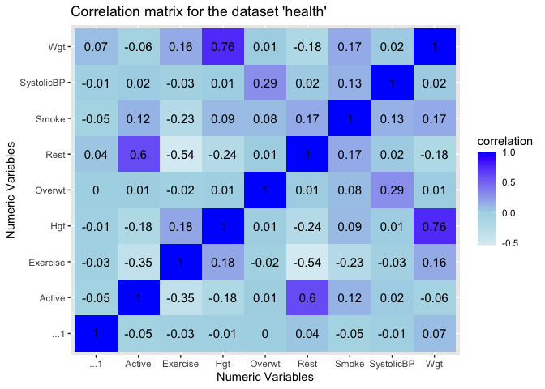
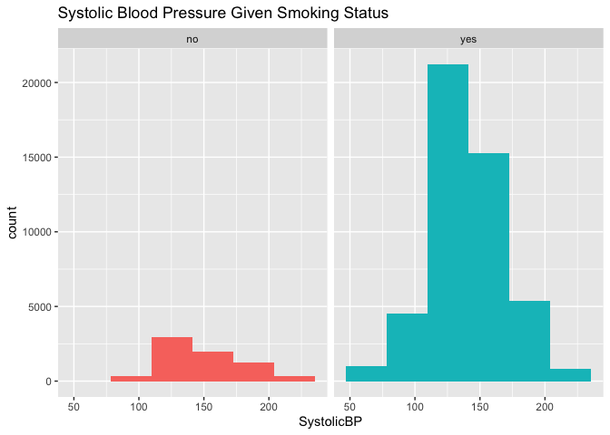
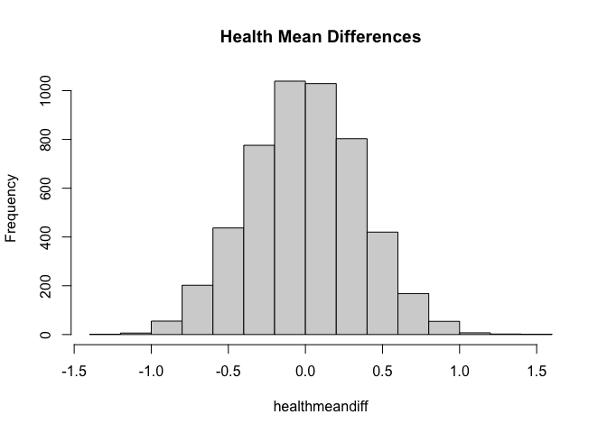
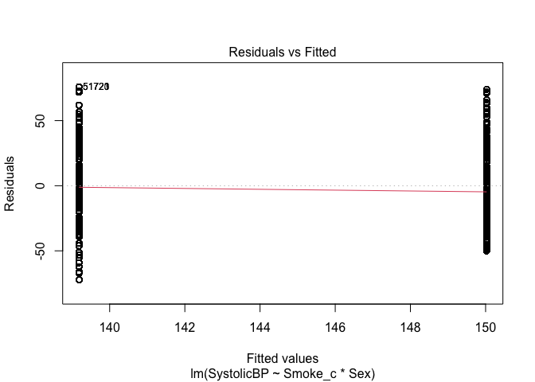
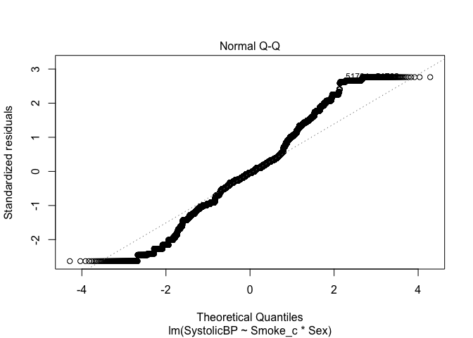
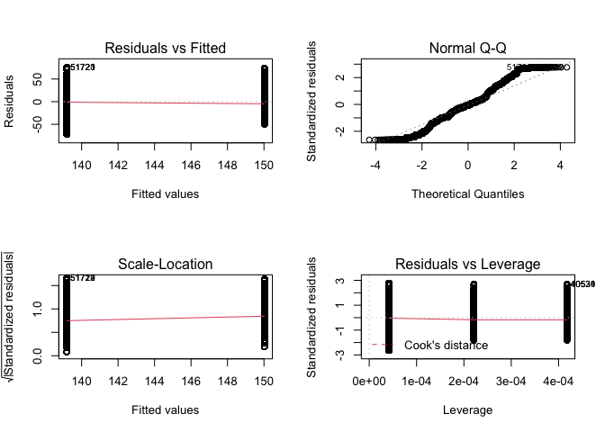
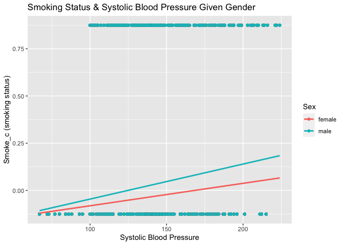
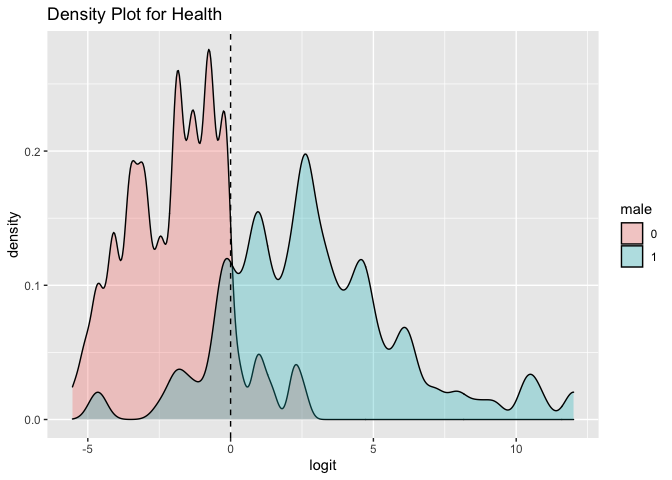
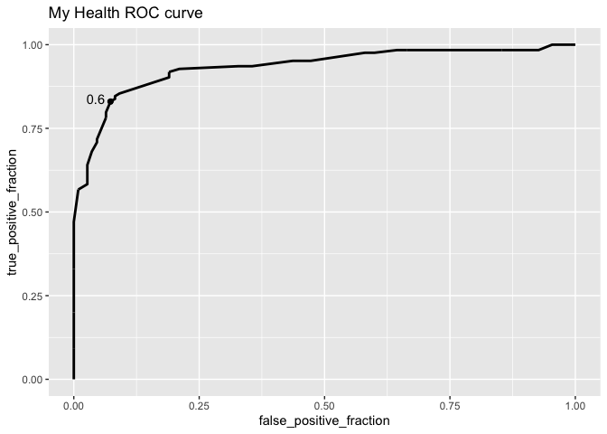

Research Project \#2: Continuation of the Comparison of Various Health
Factors Given the Smoking Status of Participants
================
SDS348 Spring 2021

## Channing Burba, cb48596

**1. Introduction:**

The first dataset that I chose, ‘PulseP2,’ measures the pulse rate of
individuals prior to and after exercise. This dataset had 232
observations. The variables include: ‘Active’-The pulse rate of an
individual prior to and after exercise, ‘Rest’-The participants regular
resting pulse, ‘Smoke’-An indication on whether the participant is a
smoker or non-smoker, ‘Sex’-The gender of the individual, ‘Exercise’-The
number of hours the participant exercises per week, ‘Hgt’-The
individual’s height, and ‘Wgt’-The individual’s weight. The second
dataset in which I compared to the first was ‘Blood.’ This dataset had
500 observations. This dataset shows the smoking status, blood pressure,
and weight of the participants in the study. The variables in this
dataset include: ‘SystolicBP’-The systolic blood pressure of the
individual, ‘Smoke’-An indication on whether the participant is a smoker
or nonsmoker, and ‘Overwt’- An indication of how overweight individuals
are (normal, overweight, or obese). The ‘PulseP2’ dataset was acquired
by both survey and experimentation. The participant’s pulses were
recorded before and after walking 3 laps up and down a set of stairs,
while information regarding their height, weight, sex, and smoking
status was acquired through survey. As for the ‘Blood’ dataset, this
information was acquired via the “2003 Annual Meeting of the Statistical
Society of Canada” case study. Once exporting and merging my datasets
into R-Studio, my data happened to already be tidy.This topic is
interesting to me because health and fitness is a huge part of my life.
I would love for healthy living to be a more widespread subject, so by
creating this research project that compares all of my chosen variables,
I hope to explain to readers why regular exercise, not smoking, and
healthy living in general is important to both your health and
well-being. Some potential associations I expect is: There will be a
significant difference between systolic blood pressure of smokers. I
also expect that there will not be a significant difference in
health/systolic blood pressure between men and women.

``` r
library(readxl) #Opens 'readxl' package to make it easy to get data out of Excel and put it into R
PulseP2 <- read_excel("PulseP2.xls") #Reads the excel sheet 'PulseP2'
View(PulseP2) #Opens the 'PulseP2' dataset in R 

library(readxl) #Opens 'readxl' package to make it easy to get data out of Excel and put it into R
Blood <- read_excel("Blood.xlsx") #Reads the excel sheet 'Blood'
View(Blood) #Opens the 'Blood' dataset in R

library("dplyr") #Opens 'dplyr' package
health <- Blood %>% inner_join(PulseP2, by=c("Smoke"= "Smoke")) #Joins together the two datasets 'PulseP2' and 'Blood' by the common variable 'Smoke'
health #Returns the new data/table 'health' which is 'PulseP2' and 'Blood' joined together on the basis of the common variable 'Smoke'
```

    ## # A tibble: 55,120 x 10
    ##    SystolicBP Smoke Overwt  ...1 Active  Rest Sex    Exercise   Hgt   Wgt
    ##         <dbl> <dbl>  <dbl> <dbl>  <dbl> <dbl> <chr>     <dbl> <dbl> <dbl>
    ##  1        133     0      2     1     97    78 female        1    63   119
    ##  2        133     0      2     3     88    62 male          3    72   175
    ##  3        133     0      2     4    106    74 male          3    72   170
    ##  4        133     0      2     5     78    63 female        3    67   125
    ##  5        133     0      2     6    109    65 male          3    74   188
    ##  6        133     0      2     7     66    43 female        3    67   140
    ##  7        133     0      2     8     68    65 male          3    70   200
    ##  8        133     0      2     9    100    63 male          1    70   165
    ##  9        133     0      2    10     70    59 female        2    65   115
    ## 10        133     0      2    11     98    57 male          3    72   175
    ## # … with 55,110 more rows

*As an extenion of my introduction, it was imperative that I joined my
datasets ‘PulseP2’ and ‘Blood’ for later comparison in my experiment.
However, during this portion, I did not need to tidy my data, as it was
already tidy once exported to R-Studio.*

**2. EDA:**

``` r
library(tidyverse) #Opens the package 'tidyverse'
plot1 <- health %>%
  select_if(is.numeric) #Selects for numeric variables
cor(plot1, use = "pairwise.complete.obs") #Returns correlation using 'pairwise.complete.obs' 
```

    ##              SystolicBP       Smoke       Overwt         ...1      Active
    ## SystolicBP  1.000000000  0.12978972  0.289384102 -0.006069631  0.01588339
    ## Smoke       0.129789715  1.00000000  0.082659281 -0.046765112  0.12237784
    ## Overwt      0.289384102  0.08265928  1.000000000 -0.003865571  0.01011566
    ## ...1       -0.006069631 -0.04676511 -0.003865571  1.000000000 -0.04919350
    ## Active      0.015883386  0.12237784  0.010115665 -0.049193501  1.00000000
    ## Rest        0.021535854  0.16592882  0.013715557  0.043775627  0.60494621
    ## Exercise   -0.029296919 -0.22572605 -0.018658353 -0.025965671 -0.35489095
    ## Hgt         0.011784076  0.09079360  0.007504934 -0.008338296 -0.17899995
    ## Wgt         0.021447081  0.16524484  0.013659020  0.073583394 -0.05738743
    ##                   Rest    Exercise          Hgt         Wgt
    ## SystolicBP  0.02153585 -0.02929692  0.011784076  0.02144708
    ## Smoke       0.16592882 -0.22572605  0.090793601  0.16524484
    ## Overwt      0.01371556 -0.01865835  0.007504934  0.01365902
    ## ...1        0.04377563 -0.02596567 -0.008338296  0.07358339
    ## Active      0.60494621 -0.35489095 -0.178999949 -0.05738743
    ## Rest        1.00000000 -0.54136348 -0.237322341 -0.17654126
    ## Exercise   -0.54136348  1.00000000  0.177197805  0.15942772
    ## Hgt        -0.23732234  0.17719781  1.000000000  0.75558689
    ## Wgt        -0.17654126  0.15942772  0.755586888  1.00000000

``` r
cor(plot1, use = "pairwise.complete.obs") %>% #Creates a new plot that chooses all numeric values 
  as.data.frame %>% #Stores data I imputed above
  rownames_to_column %>% #Converts row names into columns in plot
  pivot_longer(-1, names_to = "other_var", values_to = "correlation") %>% #Increases the number of rows and decreases the number of columns
  ggplot(aes(rowname, other_var, fill=correlation)) +
  geom_tile() +
  scale_fill_gradient2(low="white", mid="light blue", high="blue") +
  geom_text(aes(label = round(correlation,2)), color = "black", size = 4) +
  labs(title = "Correlation matrix for the dataset 'health'", x = "Numeric Variables", y = "Numeric Variables") #Creates a heatmap, adds a color gradient, and adds a title on the top of the graph 
```


*During this portion of my research, I was able to compare variables in
order to determine relationships that affect the overall health of the
participants. In the correlation matrix created (i.e. the heatmap), I
selected for all of the numeric variables within the ‘health’ dataset to
see the correlation between them. I used a blue color gradient in order
to determine how strong the correlation was from one variable to
another. It was evident that from this map, there were strong
correlations between ‘Hgt’ and ‘Wgt’ and ‘Rest’ and "Active’ pulses.
However, I saw a strong negative correlation between ‘Sex’ and ‘Hgt.’*

**3. MANOVA:**

``` r
#MANOVA
HealthManovaTEST <- manova(cbind(SystolicBP, Smoke, Overwt, Active, Rest, Exercise, Hgt, Wgt) ~ Sex, data = health) #Conducts a MANOVA test to investigate whether at least one of the eight numeric variables differ by sex
summary(HealthManovaTEST) #Returns a summary of the manova test
```

    ##              Df  Pillai approx F num Df den Df    Pr(>F)    
    ## Sex           1 0.60742    10659      8  55111 < 2.2e-16 ***
    ## Residuals 55118                                             
    ## ---
    ## Signif. codes:  0 '***' 0.001 '**' 0.01 '*' 0.05 '.' 0.1 ' ' 1

``` r
#ANOVA and Post Hoc
summary.aov(HealthManovaTEST) #Conducts and returns an ANOVA test for each numeric variable in the dataset 
```

    ##  Response SystolicBP :
    ##                Df   Sum Sq Mean Sq F value   Pr(>F)   
    ## Sex             1     6504  6503.8  8.4941 0.003564 **
    ## Residuals   55118 42203129   765.7                    
    ## ---
    ## Signif. codes:  0 '***' 0.001 '**' 0.01 '*' 0.05 '.' 0.1 ' ' 1
    ## 
    ##  Response Smoke :
    ##                Df Sum Sq Mean Sq F value    Pr(>F)    
    ## Sex             1   55.3  55.323  508.82 < 2.2e-16 ***
    ## Residuals   55118 5992.9   0.109                      
    ## ---
    ## Signif. codes:  0 '***' 0.001 '**' 0.01 '*' 0.05 '.' 0.1 ' ' 1
    ## 
    ##  Response Overwt :
    ##                Df Sum Sq Mean Sq F value  Pr(>F)  
    ## Sex             1      3 2.59395  3.4449 0.06345 .
    ## Residuals   55118  41503 0.75298                  
    ## ---
    ## Signif. codes:  0 '***' 0.001 '**' 0.01 '*' 0.05 '.' 0.1 ' ' 1
    ## 
    ##  Response Active :
    ##                Df   Sum Sq Mean Sq F value    Pr(>F)    
    ## Sex             1   611277  611277  1787.2 < 2.2e-16 ***
    ## Residuals   55118 18851625     342                      
    ## ---
    ## Signif. codes:  0 '***' 0.001 '**' 0.01 '*' 0.05 '.' 0.1 ' ' 1
    ## 
    ##  Response Rest :
    ##                Df  Sum Sq Mean Sq F value    Pr(>F)    
    ## Sex             1  142909  142909    1486 < 2.2e-16 ***
    ## Residuals   55118 5300732      96                      
    ## ---
    ## Signif. codes:  0 '***' 0.001 '**' 0.01 '*' 0.05 '.' 0.1 ' ' 1
    ## 
    ##  Response Exercise :
    ##                Df  Sum Sq Mean Sq F value    Pr(>F)    
    ## Sex             1   477.7  477.70  890.92 < 2.2e-16 ***
    ## Residuals   55118 29554.0    0.54                      
    ## ---
    ## Signif. codes:  0 '***' 0.001 '**' 0.01 '*' 0.05 '.' 0.1 ' ' 1
    ## 
    ##  Response Hgt :
    ##                Df Sum Sq Mean Sq F value    Pr(>F)    
    ## Sex             1 432982  432982   71341 < 2.2e-16 ***
    ## Residuals   55118 334524       6                      
    ## ---
    ## Signif. codes:  0 '***' 0.001 '**' 0.01 '*' 0.05 '.' 0.1 ' ' 1
    ## 
    ##  Response Wgt :
    ##                Df   Sum Sq  Mean Sq F value    Pr(>F)    
    ## Sex             1 26545638 26545638   49649 < 2.2e-16 ***
    ## Residuals   55118 29469575      535                      
    ## ---
    ## Signif. codes:  0 '***' 0.001 '**' 0.01 '*' 0.05 '.' 0.1 ' ' 1

``` r
pairwise.t.test(health$SystolicBP,health$Sex,p.adj = "none") #Conducts and returns a 'post-hoc' test for 'SystolicBP'
```

    ## 
    ##  Pairwise comparisons using t tests with pooled SD 
    ## 
    ## data:  health$SystolicBP and health$Sex 
    ## 
    ##      female
    ## male 0.0036
    ## 
    ## P value adjustment method: none

``` r
pairwise.t.test(health$Smoke,health$Sex,p.adj = "none") #Conducts and returns a 'post-hoc' test for 'Smoke'
```

    ## 
    ##  Pairwise comparisons using t tests with pooled SD 
    ## 
    ## data:  health$Smoke and health$Sex 
    ## 
    ##      female
    ## male <2e-16
    ## 
    ## P value adjustment method: none

``` r
pairwise.t.test(health$Overwt,health$Sex,p.adj = "none") #Conducts and returns a 'post-hoc' test for 'Overwt'
```

    ## 
    ##  Pairwise comparisons using t tests with pooled SD 
    ## 
    ## data:  health$Overwt and health$Sex 
    ## 
    ##      female
    ## male 0.063 
    ## 
    ## P value adjustment method: none

``` r
pairwise.t.test(health$Active,health$Sex,p.adj = "none") #Conducts and returns a 'post-hoc' test for 'Active'
```

    ## 
    ##  Pairwise comparisons using t tests with pooled SD 
    ## 
    ## data:  health$Active and health$Sex 
    ## 
    ##      female
    ## male <2e-16
    ## 
    ## P value adjustment method: none

``` r
pairwise.t.test(health$Rest,health$Sex,p.adj = "none") #Conducts and returns a 'post-hoc' test for 'Rest'
```

    ## 
    ##  Pairwise comparisons using t tests with pooled SD 
    ## 
    ## data:  health$Rest and health$Sex 
    ## 
    ##      female
    ## male <2e-16
    ## 
    ## P value adjustment method: none

``` r
pairwise.t.test(health$Exercise,health$Sex,p.adj = "none") #Conducts and returns a 'post-hoc' test for 'Exercise'
```

    ## 
    ##  Pairwise comparisons using t tests with pooled SD 
    ## 
    ## data:  health$Exercise and health$Sex 
    ## 
    ##      female
    ## male <2e-16
    ## 
    ## P value adjustment method: none

``` r
pairwise.t.test(health$Hgt,health$Sex,p.adj = "none") #Conducts and returns a 'post-hoc' test for 'Hgt'
```

    ## 
    ##  Pairwise comparisons using t tests with pooled SD 
    ## 
    ## data:  health$Hgt and health$Sex 
    ## 
    ##      female
    ## male <2e-16
    ## 
    ## P value adjustment method: none

``` r
pairwise.t.test(health$Wgt,health$Sex,p.adj = "none") #Conducts and returns a 'post-hoc' test for 'Wgt'
```

    ## 
    ##  Pairwise comparisons using t tests with pooled SD 
    ## 
    ## data:  health$Wgt and health$Sex 
    ## 
    ##      female
    ## male <2e-16
    ## 
    ## P value adjustment method: none

``` r
#Adjusted ANOVA and Post Hoc
1 - 0.95^18 #Calculates the probability of making at least one type I error
```

    ## [1] 0.6027857

``` r
0.05/18 #Returns the significance level that should be used to keep the overall type I error rate at .05
```

    ## [1] 0.002777778

``` r
pairwise.t.test(health$SystolicBP, health$Sex,p.adj = "bonferroni") #Runs an adjusted 'post-hoc tests for 'SystolicBP'
```

    ## 
    ##  Pairwise comparisons using t tests with pooled SD 
    ## 
    ## data:  health$SystolicBP and health$Sex 
    ## 
    ##      female
    ## male 0.0036
    ## 
    ## P value adjustment method: bonferroni

``` r
pairwise.t.test(health$Smoke, health$Sex,p.adj = "bonferroni") #Runs an adjusted 'post-hoc tests for 'Smoke'
```

    ## 
    ##  Pairwise comparisons using t tests with pooled SD 
    ## 
    ## data:  health$Smoke and health$Sex 
    ## 
    ##      female
    ## male <2e-16
    ## 
    ## P value adjustment method: bonferroni

``` r
pairwise.t.test(health$Overwt, health$Sex,p.adj = "bonferroni") #Runs an adjusted 'post-hoc tests for 'Overwt'
```

    ## 
    ##  Pairwise comparisons using t tests with pooled SD 
    ## 
    ## data:  health$Overwt and health$Sex 
    ## 
    ##      female
    ## male 0.063 
    ## 
    ## P value adjustment method: bonferroni

``` r
pairwise.t.test(health$Active, health$Sex,p.adj = "bonferroni") #Runs an adjusted 'post-hoc tests for 'Active'
```

    ## 
    ##  Pairwise comparisons using t tests with pooled SD 
    ## 
    ## data:  health$Active and health$Sex 
    ## 
    ##      female
    ## male <2e-16
    ## 
    ## P value adjustment method: bonferroni

``` r
pairwise.t.test(health$Rest, health$Sex,p.adj = "bonferroni") #Runs an adjusted 'post-hoc tests for 'Rest'
```

    ## 
    ##  Pairwise comparisons using t tests with pooled SD 
    ## 
    ## data:  health$Rest and health$Sex 
    ## 
    ##      female
    ## male <2e-16
    ## 
    ## P value adjustment method: bonferroni

``` r
pairwise.t.test(health$Exercise, health$Sex,p.adj = "bonferroni") #Runs an adjusted 'post-hoc tests for 'Exercise'
```

    ## 
    ##  Pairwise comparisons using t tests with pooled SD 
    ## 
    ## data:  health$Exercise and health$Sex 
    ## 
    ##      female
    ## male <2e-16
    ## 
    ## P value adjustment method: bonferroni

``` r
pairwise.t.test(health$Hgt, health$Sex,p.adj = "bonferroni") #Runs an adjusted 'post-hoc tests for 'Hgt'
```

    ## 
    ##  Pairwise comparisons using t tests with pooled SD 
    ## 
    ## data:  health$Hgt and health$Sex 
    ## 
    ##      female
    ## male <2e-16
    ## 
    ## P value adjustment method: bonferroni

``` r
pairwise.t.test(health$Wgt, health$Sex,p.adj = "bonferroni") #Runs an adjusted 'post-hoc tests for 'Wgt'
```

    ## 
    ##  Pairwise comparisons using t tests with pooled SD 
    ## 
    ## data:  health$Wgt and health$Sex 
    ## 
    ##      female
    ## male <2e-16
    ## 
    ## P value adjustment method: bonferroni

*After conducting the MANOVA test, it is clear to say that at least one
of the 8 numeric variables does in fact significantly differ by sex.
Some of my results were as follows: P-value- 2.2e-16. Because this value
is less than 0.05, I rejected the null hypothesis. This means that the
numeric variables (SystolicBP, Smoke, Overwt, Active, Rest, Exercise,
Hgt, Wgt) are not the same across sexes. Because my values were
significant, I performed a univariate ANOVA test and performed post-hoc
t-tests to find which groups differ. After conducting the ANOVA summary
above, I was able to obtain the ‘P-values’ of each numeric variable from
the F-statistic- SystolicBP: 0.003564, Smoke: 2.2e-16, Overwt: 0.06345,
Active: 2.2e-16, Rest: 2.2e-16, Exercise: 2.2e-16, Hgt: 2.2e-16,
Wgt:2.2e-16. My ‘SystolicBp’ and ‘Overwt’ variables happened to be
greater than 0.05, but after correction, the ‘Overwt’ variable was the
only variable with a p-value larger than 0.05. From here, the variables
‘SystolicBp,’‘Smoke,’‘Active,’‘Rest,’‘Exercise,’‘Hgt,’ and ‘Wgt’
p-values happened to be less than 0.05, leading me to the conclusion
that these numeric variables significantly differed by sex. I performed
1 MANOVA test, an ANOVA/post-hoc test for each of my 8 variables, and an
adjusted ANOVA/post-hoc for each of the 8 variables. The probability of
at least one type I error is 0.4012631. ANOVA assumes that the data is
normally distributed, that there is homogeneity of variance, and that
the observations are independent of each other. With that being said, I
predict a normal distribution histogram after running a randomization
test.*

**4. Randomization test:**

``` r
library(dplyr) #Opens 'dplyr' package 
set.seed(348)
health %>%
  mutate(across(c(Smoke),
                ~factor(ifelse(.x == "1", "no", "yes")))) %>%
  ggplot(aes(SystolicBP, fill= Smoke)) +
  geom_histogram(bins = 6) + facet_wrap(~Smoke, ncol=2) + theme(legend.position = "none") +labs(title = "Systolic Blood Pressure Given Smoking Status") #Runs a randomization test using the 'health' data
```



``` r
healthmeandiff <- vector() #This code creates an empty vector in order to store the 'Smoke' data (generates a distribution of 5000 mean differences).
for(i in 1:5000){ 
myhealth <- data.frame(Smoke = health$Smoke, SystolicBP = sample(health$SystolicBP)) #Creates a dataset in which compares 'Smoke' and 'SystolicBP' 
healthmeandiff[i] <- myhealth %>% group_by(Smoke) %>% summarise(means = mean(SystolicBP)) %>% summarise(healthmeandiff = diff(means))%>% pull
} #This code creates a loop of 5000 mean differences
{ hist(healthmeandiff, main= "Health Mean Differences"); abline(v=8.4941, col="red") #Returns a histogram to showcase the "Health Mean Differences"
}  
```


*My null hypothesis is: There is no significant difference between
systolic blood pressure and smoking status. My alternative hypothesis
is: There is a significant difference between systolic blood pressure
and smoking status. After looking at the data returned, I saw that the
proportion of F-statistic that is greater than the observed F-statistic
is 0, the null hypothesis is rejected so there is a clear indication
that there is a significant difference between systolic blood pressure
and smoking status (so I rejected the null hypothesis).*

**5. Linear Regression:**

``` r
library(lmtest)
install.packages("lmtest", repos= "http://cran.us.r-project.org")
```

    ## 
    ## The downloaded binary packages are in
    ##  /var/folders/t7/cpczs0d9249crvl9mz3_jxq00000gn/T//Rtmp0CV7HE/downloaded_packages

``` r
health$Smoke_c <- health$Smoke - mean(health$Smoke) #Centers the data around the means 
healthfit_c <- lm(SystolicBP ~ Smoke_c * Sex, data = health)
summary(healthfit_c) #Fits a multiple linear regression model for systolic blood pressure with smoking status and and if the individual is overweight as predictors
```

    ## 
    ## Call:
    ## lm(formula = SystolicBP ~ Smoke_c * Sex, data = health)
    ## 
    ## Residuals:
    ##     Min      1Q  Median      3Q     Max 
    ## -72.184 -15.026  -1.184  11.816  75.816 
    ## 
    ## Coefficients:
    ##                   Estimate Std. Error t value Pr(>|t|)    
    ## (Intercept)      1.405e+02  1.712e-01  820.84   <2e-16 ***
    ## Smoke_c          1.084e+01  5.885e-01   18.42   <2e-16 ***
    ## Sexmale         -4.487e-14  2.353e-01    0.00        1    
    ## Smoke_c:Sexmale  7.116e-14  7.372e-01    0.00        1    
    ## ---
    ## Signif. codes:  0 '***' 0.001 '**' 0.01 '*' 0.05 '.' 0.1 ' ' 1
    ## 
    ## Residual standard error: 27.44 on 55116 degrees of freedom
    ## Multiple R-squared:  0.01685,    Adjusted R-squared:  0.01679 
    ## F-statistic: 314.8 on 3 and 55116 DF,  p-value: < 2.2e-16

``` r
plot(healthfit_c, which = 1)
```



``` r
bptest(healthfit_c) #Checks assumptions for linearity and homoscedasticity
```

    ## 
    ##  studentized Breusch-Pagan test
    ## 
    ## data:  healthfit_c
    ## BP = 1.8061e-07, df = 3, p-value = 1

``` r
plot(healthfit_c, which = 2)
```



``` r
shapiro.test(healthfit_c$residuals[0:5000]) #Checks assumptions for normality
```

    ## 
    ##  Shapiro-Wilk normality test
    ## 
    ## data:  healthfit_c$residuals[0:5000]
    ## W = 0.76508, p-value < 2.2e-16

``` r
par(mfrow = c(2, 2))
plot(healthfit_c) #Checks the assumptions visually for the regression model created above
```



``` r
hist(healthfit_c$residuals, col="pink")
ggplot(healthfit_c, aes(x = SystolicBP, y = Smoke_c, color= Sex)) +
  geom_point() +
  geom_smooth(method=lm, se=FALSE, fullrange=TRUE) +
  labs(title = "Smoking Status & Systolic Blood Pressure Given Gender", x= "Systolic Blood Pressure", y= "Smoke_c (smoking status)") #Creates a ggplot that shows the interaction between the smoking status and how overweight participants are 
set.seed(348)
healthsamp_SEs <- replicate(5000, { #Bootstraps my data to resample observations
  healthboot_data <- sample_frac(health, replace = TRUE) #Fit regression model
  healthfitboot <- lm(SystolicBP ~ Smoke_c * Sex, data = healthboot_data) #Save the coefficients in 'healthfitboot'
  coef(healthfitboot) #Returns coefficient of 'healthfitboot' data
})
healthsamp_SEs %>%
  t %>%
  as.data.frame %>%
  summarize_all(sd) #Returns the Robust sample standard errors
```

    ##   (Intercept)  Smoke_c   Sexmale Smoke_c:Sexmale
    ## 1   0.1719042 0.587256 0.2338528       0.7352984


*When looking at the coefficients returned, ‘intercepts’ has a positive
value. Individually, ‘Smoke\_c,’ ‘Sexmale,’ and ‘Smoke\_c:Sexmale’ also
have positive values. This positive coefficient value indicates that as
the value of the independent variables increase (i.e. the explanatory
variables), the mean of the dependent variable also tends to increase
(i.e. systolic blood pressure). However, for the variable ‘Sexmale,’ the
coefficient value is negative. A negative coefficient means that as the
independent variable changes (i.e. ‘Sex’ in this case), the dependent
variable tends to decrease. That means that the gender of the
participant is not steadily increasing systolic blood pressure (there is
no positive correlation between the two). The proportion of variation in
response to my model is 0.01679. Before recomputing regression results
with robust standard errors, assumptions are not being met. When this
process occurs, my data is essentially modified to a point where it will
be less likely that I would reject my null hypothesis. The significance
of recomputing regression results with robust standard errors is to
essentially compensate for failed assumptions. After I computed the
bootstrapped standard errors, I observed a decrease in SEs compared to
the original standard errors (as my new SEs were all below 1).*

**6. Logistic Regression:**

``` r
newhealth <- health %>%
  mutate(health_code = ifelse(Sex== "male" ,1,0)) #Creates a binary variable coded as 0 and 1 
healthfit2 <- glm(health_code ~ Wgt + Smoke, data = newhealth, family = binomial(link="logit")) #Fit a new regression model called "healthfit2"
summary(healthfit2) #Returns a summary of "healthfit2"
```

    ## 
    ## Call:
    ## glm(formula = health_code ~ Wgt + Smoke, family = binomial(link = "logit"), 
    ##     data = newhealth)
    ## 
    ## Deviance Residuals: 
    ##      Min        1Q    Median        3Q       Max  
    ## -2.29925  -0.53491   0.01387   0.38415   3.05207  
    ## 
    ## Coefficients:
    ##               Estimate Std. Error  z value Pr(>|z|)    
    ## (Intercept) -1.686e+01  1.460e-01 -115.520  < 2e-16 ***
    ## Wgt          1.110e-01  9.674e-04  114.777  < 2e-16 ***
    ## Smoke       -3.157e-01  4.328e-02   -7.294 3.01e-13 ***
    ## ---
    ## Signif. codes:  0 '***' 0.001 '**' 0.01 '*' 0.05 '.' 0.1 ' ' 1
    ## 
    ## (Dispersion parameter for binomial family taken to be 1)
    ## 
    ##     Null deviance: 76242  on 55119  degrees of freedom
    ## Residual deviance: 36600  on 55117  degrees of freedom
    ## AIC: 36606
    ## 
    ## Number of Fisher Scoring iterations: 6

``` r
exp(coef(healthfit2)) #Interprets the coefficients by considering the odds (inverse of log(odds))
```

    ##  (Intercept)          Wgt        Smoke 
    ## 4.750986e-08 1.117438e+00 7.293088e-01

``` r
newhealth$prob <- predict(healthfit2, type = "response") #Adds predicted probabilities to the dataset
newhealth$predicted <- ifelse(newhealth$prob > .5, "male", "female") #If the probability is comes out to be greater than 0.5, the participant is a male 
table(truth = newhealth$health_code, prediction = newhealth$predicted) #Returns a Confusion matrix
```

    ##      prediction
    ## truth female  male
    ##     0  23890  2138
    ##     1   4478 24614

``` r
(23890+24614)/ 55120 #Accuracy (correctly classified cases)
```

    ## [1] 0.879971

``` r
24614/ 29092 #Sensitivity (TPR)
```

    ## [1] 0.8460745

``` r
23890/ 26028 #Specificity (TNR)
```

    ## [1] 0.9178577

``` r
24614/26752 #Precision (PPV)
```

    ## [1] 0.9200807

``` r
newhealth$logit <- predict(healthfit2) #Density plot of log-odds for each outcome 
ggplot(newhealth, aes(logit, fill = as.factor(health_code))) +
  geom_density(alpha = .3) +
  geom_vline(xintercept = 0, lty = 2) +
  labs(fill = "male") + labs(title = "Density Plot for Health") #Creates a ggplot to compare to the outcome in the dataset with a density plot
```



``` r
library(plotROC)
newhealth$prob1 <- predict(healthfit2,type="response")
healthROCplot <- ggplot(newhealth) + geom_roc(aes(d=health_code ,m=prob1),cutoffs.at= list(0.6))+ggtitle("My Health ROC curve")
healthROCplot #Generates a ROC plot 
```



``` r
calc_auc(healthROCplot) #Calculates AUC 
```

    ##   PANEL group       AUC
    ## 1     1    -1 0.9331042

*After calculating the accuracy of my data, my value was 0.879971. This
value is predicting if the participant is “male” or “female” with
87.9971% accuracy. Essentially, accuracy is the ratio of correct
predictions (i.e. “male”, “female”) to total predictions made.
Sensitivity (TPR) is calculated as the number of correct positive
predictions divided by the total number of positives (i.e. in this case,
the total number of males divided by the total predictions made). The
best sensitivity is 1.0, so 0.8460745 is pretty accurate. Specificity
(TNR) is calculated as the number of correct negative predictions
divided by the total number of negatives (i.e. in this specific case,
this is the total number of females divided by the total number of
negatives (i.e. total females)). The best specificity is 1.0, so a value
of 0.9178577 is very accurate. Precision/recall is calculated as the
number of correct positive predictions divided by the total number of
positive predictions (i.e. total male values divided by the total number
of positive predictions of male values). The best precision is 1.0, so a
value of 0.9200807 is very accurate. An AUC test is an effective way to
summarize the overall diagnostic accuracy. The test returns values from
0 to 1, 1 being the most accurate. My AUC vales was 0.9331042, meaning
my test was very accurate.*

**Cited Data Sources: **

Blood:
<https://vincentarelbundock.github.io/Rdatasets/doc/Stat2Data/Blood1.html>

Pulse2:
<https://vincentarelbundock.github.io/Rdatasets/doc/Stat2Data/Pulse.html>
